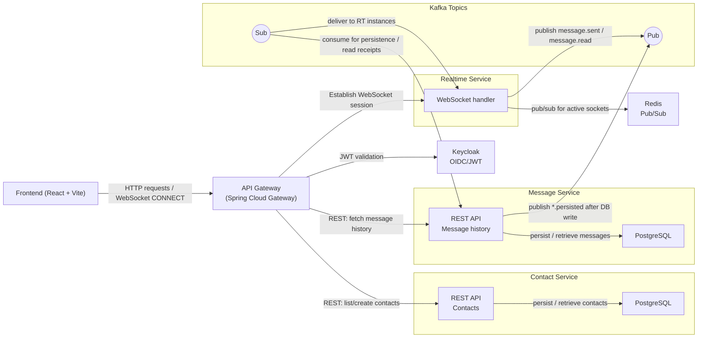
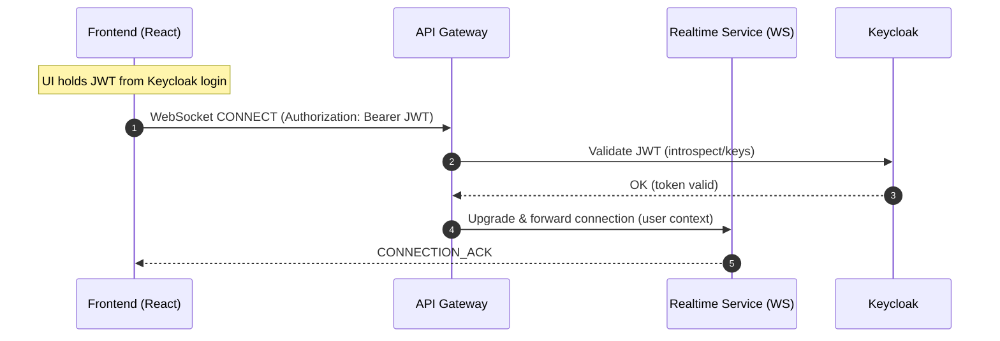
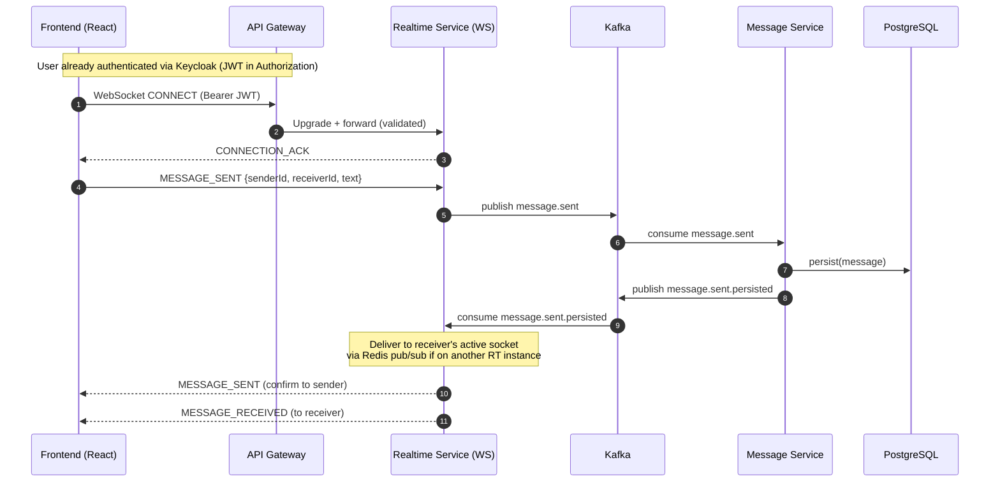
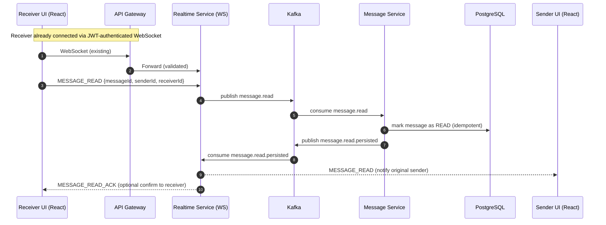

# 🗨️ Chat App - Microservices

A **lightweight real-time messaging system** with **secure authentication**, **contact management**, **instant messaging**, and **read receipts**.  
Built as an **MVP** with a **microservices approach**, it demonstrates **scalable communication** powered by **Spring
Boot 3**, **Keycloak**, **Kafka**, **Redis**, and **PostgreSQL**.

### Key highlights:

- Clear separation of concerns across services
- Asynchronous, event-driven communication with **Kafka**
- Real-time updates via **WebSockets + Redis pub/sub**
- Secure user management with **Keycloak**
- Extensible design for future production scaling

This project is built as **pre-production**: optimized for local/MVP deployment, but designed to extend into a
production-ready system.

## 📋 Requirements (User Stories)

### 🔑 Log In & Out

**As a chat app user**  
I want to log in and out securely,  
**So that** my messages and personal details remain private.

- A user can log in securely
- A user can log out securely
- A user’s credentials are stored securely (via Keycloak)

### 👫 Add a Contact

**As a chat app user**  
I want to add a contact,  
**So that** I can send messages to them.

- Add a contact using their unique identifier (Keycloak ID)
- Assign a custom display name for each contact

### ✉️ Send & Receive Messages

**As a chat app user**  
I want to send and receive messages,  
**So that** I can chat with my contacts.

- Send messages to added contacts
- Receive messages from added contacts

### 👀 Message Read Notifications

**As a chat app user**  
I want to be notified when my messages are read,  
**So that** I have more context during chats.

- Visual indication when a contact reads the message

## 🛠 Tech Stack

- **Java 21**, **Spring Boot 3**
- **Spring WebFlux** — reactive, efficient resource consumption
- **Spring Data JPA + PostgreSQL** — persistence per service
- **Apache Kafka** — asynchronous inter-service communication
- **Redis** — pub/sub for WebSocket message routing
- **Docker & Docker Compose** — containerization & orchestration
- **Keycloak** — authentication and authorization (OIDC/JWT)
- **React + Vite** — frontend client
- **Spring Cloud Gateway** — unified API gateway

## 🏗 Architecture Design

### API Gateway

- Single entry point for frontend → backend communication
- Routes requests to appropriate services
- Handles **JWT validation** with Keycloak
- Stateless (no database)

### Contact Service

- Manages user contacts
- REST Endpoints:
	- `GET /api/v1/contacts` — list all user contacts
	- `POST /api/v1/contacts` — create a new contact

- Dependencies:
	- PostgreSQL (for persisting contacts)

### Realtime Communication Service (RTCS)

- Exposes **WebSocket API** for messaging
- Handles live events (send, receive, read)
- Uses **Redis pub/sub** to route WebSocket events across instances
- Publishes/consumes Kafka topics:
	- `message.sent`
	- `message.read`
	- `message.sent.persisted`
	- `message.read.persisted`

### Message Service

- Stores and manages chat messages
- REST Endpoints:
	- `GET /api/v1/messages/history/{contactUserId}` — retrieve chat history

- Collaborates with RTCS via Kafka topics
- Persists messages in PostgreSQL

### Redis

- Pub-sub system for routing WebSocket messages
- Ensures messages reach the correct RTCS instance

### Kafka

- Backbone of asynchronous communication between services
- Separates **event handling** from **persistence**
- Enables horizontal scaling of RTCS and Message Service

## 🏛 High-Level Overview



## REST API 

- `GET /api/v1/contacts` → list user’s contacts
- `POST /api/v1/contacts` → create a new contact
- `GET /api/v1/messages/history/{contactUserId}` → fetch message history

All REST endpoints require a valid **JWT token** from Keycloak in the `Authorization` header.

## WebSocket API

### 📡 Connection Acknowledged

Sent by backend when WebSocket connection is established:

```json
{
  "id": "617cb901-9b11-4ef2-8320-37e7a61264de",
  "type": "CONNECTION_ACK",
  "payload": null
}
```

### Runtime Flow - Connection Acknowledged



### ✉️ Message Sent

Represents a new outgoing message:

```json
{
  "id": "617cb901-9b11-4ef2-8320-37e7a61264de",
  "type": "MESSAGE_SENT",
  "payload": {
    "messageId": "064ca7fa-1a71-468a-9a03-b84dfe302228",
    "senderId": "6320cc0b-9139-4849-8576-69de8c4d1b28",
    "receiverId": "445a823f-49f7-41d7-a4b8-444f54495738",
    "text": "Hello World!"
  }
}
```

### Runtime Flow - Message Sent



### 👀 Message Read

Represents a read receipt for a message:

```json
{
  "id": "617cb901-9b11-4ef2-8320-37e7a61264de",
  "type": "MESSAGE_READ",
  "payload": {
    "messageId": "064ca7fa-1a71-468a-9a03-b84dfe302228",
    "senderId": "6320cc0b-9139-4849-8576-69de8c4d1b28",
    "receiverId": "445a823f-49f7-41d7-a4b8-444f54495738"
  }
}
```

### Runtime Flow - Message Read



## 🗺️ Future Improvements

- Add **CRUD operations for contacts** (edit/delete)
- Implement **Dead Letter Queue (DLQ)** for Kafka error handling
- Add **monitoring & observability** (Prometheus + Grafana + OpenTelemetry)
- Implement **horizontal scaling** in cloud environments
- Expand message features: attachments, group chats, typing indicators

